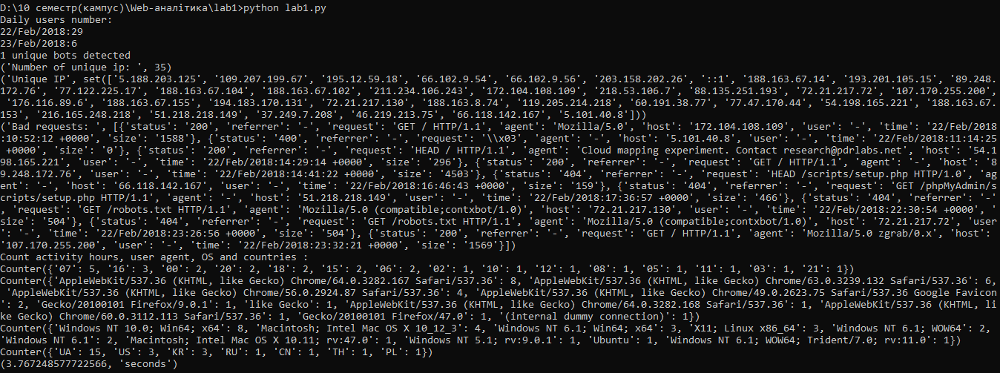
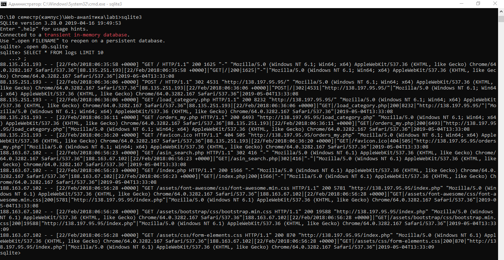

# web_analytics_lab1
*lab1*

Було проаналізовано файл *access.log* з використанням Python 2.7. Файл *access.log* містить логи за 2 дні - 22.02.2018 і 23.02.2018.

1.Функція **daily_u()** визначає кількість користувачів за добу. За 22.02.2018 було **29** користувачів, а за 23.02.2018 - **6** відповідно.

2.Функція **bots()** повертає кількість унікальних агентів що містять слово **'bot'**. Було виявлено **1** унікального бота.

3.**len(count_unique)** повертає кількість унікальних IP-адрес. Всього їх **35**.

4.**count_unique** виводить список унікальних IP.

5.**bad_requests** повертає невдалі запити, наприклад які містять status code **400**, **404**.

6.**get_hour** повертає години активності користувачів в порядку спадання активності.

7.**counter['agent']** виводить список агентів що здійснювали запити, а також їх кількість в порядку спадання.

8.**counter['OS']** виводить список з назв операційних систем та їх версій, а також кількість цих ОС в порядку спадання.

9.**get_country()** повертає перелік країн, з яких здійснювались запити, а також їх кількість в порядку спадання.

За допомогою **time.clock()** було обчислено час виконання наведених вище функцій в секундах.
Результати виконання команди *python lab1.py* наведено на скріншоті:

З використанням файлу *db.py* логи було збережено в базу даних *SQLite*(файл *db.sqlite*). Це можна легко перевірити з використанням командного рядка.
Результати подані на скріншоті:

